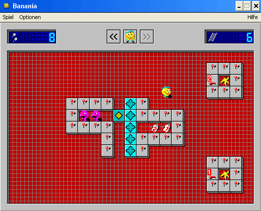

# Banania 3D

A 3D remake of the classic Windows 95 game "Banania" using Three.js.

## About the Game

Banania 3D is a homage to the original Banania computer game from Windows 95. The game was originally created by Rüdiger Appel and Markuß Golschinski and published by Data Becker.

In this game, you play as Berti, the garbage collector, who has been called into a warehouse to clean up after a runaway monkey. The monkey has hidden on the 51st floor and has left banana peels all over the floors. Your task is to collect all the banana peels while avoiding the garbage monsters.

## How to Play

1. Use the arrow keys to move Berti around the level.
2. Collect all banana peels to activate the exit.
3. Avoid the green and purple monsters - they will kill you if they touch you.
4. Push blocks to create paths or block monsters.
5. Collect keys to unlock doors with corresponding numbers.
6. Reach the exit after collecting all bananas to advance to the next level.

## Game Features

- 3D remake of the original 2D game
- Same game mechanics and level designs as the original
- Original sounds from the Windows 95 version
- Multiple levels with increasing difficulty
- Two types of monsters with different behaviors
- Blocks that can be pushed to create paths or block monsters
- Keys and doors with matching colors

## Technical Details

- Built with Three.js for 3D rendering
- Uses original game assets (sounds, level designs) from the JavaScript remake
- Responsive design that works on both desktop and mobile devices
- Touch controls for mobile play

## Controls

- **Arrow Keys**: Move Berti
- **R Key**: Restart level (when game over)
- **Space/Enter**: Start game
- **Touch/Swipe**: Move Berti (on mobile devices)

## Credits

- Original Game: Rüdiger Appel and Markuß Golschinski
- JavaScript Port: Benjamin Richner
- 3D Remake: [Your Name]

## License

This project is a fan remake and is not affiliated with the original creators or publishers of Banania. All original game assets and concepts belong to their respective owners.
